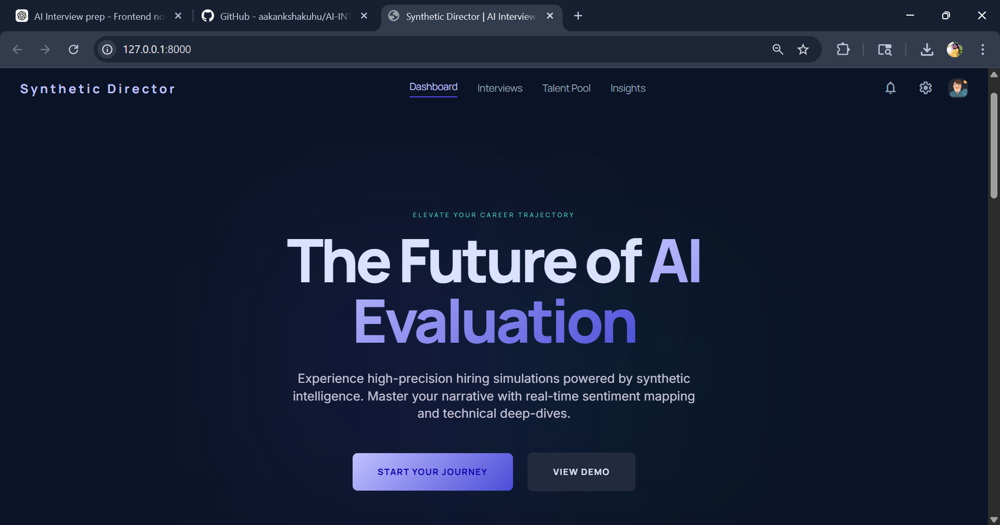
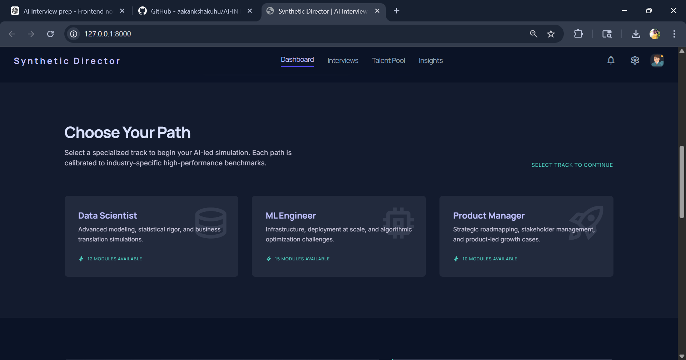
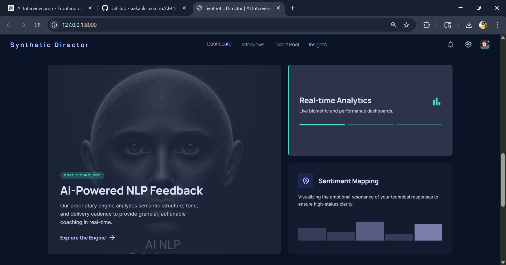
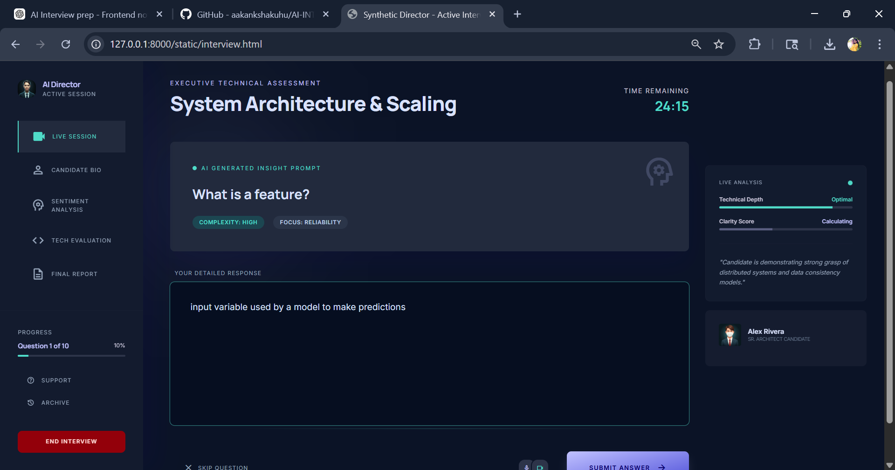
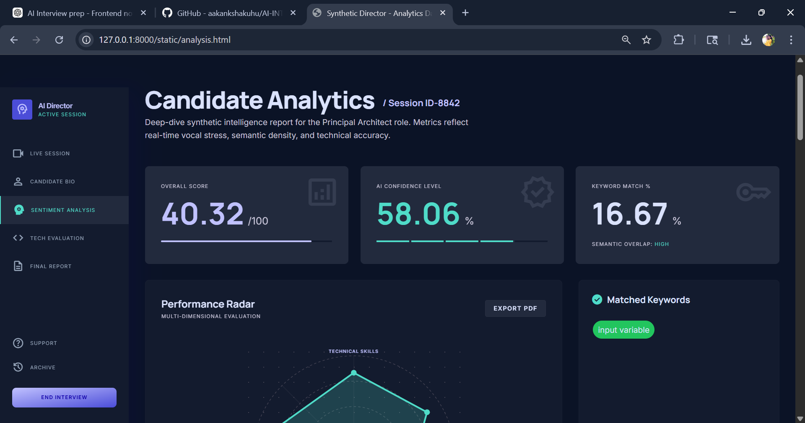
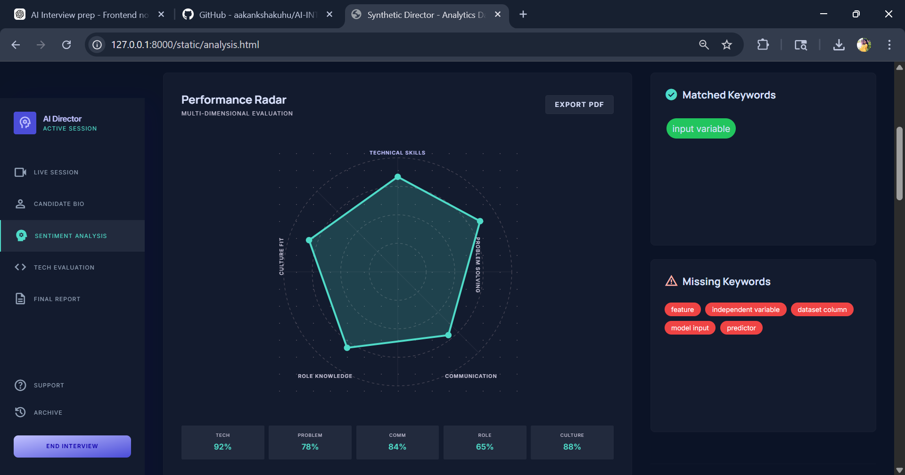
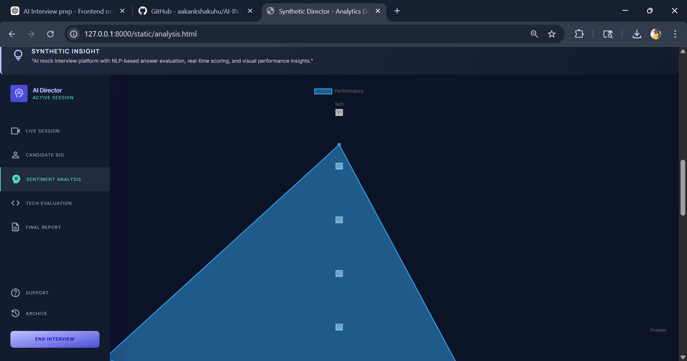
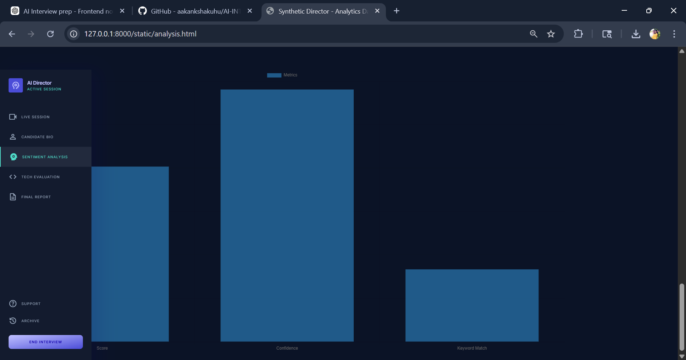

# 🤖 AI Interview Simulation Platform

An AI-powered mock interview platform that simulates real interview scenarios, evaluates responses using NLP techniques, and provides detailed performance analytics with visual insights.

---

## 🚀 Overview

This project is a full-stack AI interview simulation system where users can practice role-based interviews and receive structured, data-driven feedback.

The platform evaluates answers using a hybrid NLP approach combining **TF-IDF + Cosine Similarity + Keyword Matching**, and presents results through an interactive analytics dashboard.

---

## 🎯 Key Features

### 🎤 Mock Interview Engine
- Role-based question generation (e.g., Data Scientist)
- Session-based interview flow
- Dynamic question progression

### 🧠 AI Evaluation System
- TF-IDF vectorization for semantic similarity
- Cosine similarity scoring
- Keyword-based evaluation for concept coverage
- Hybrid scoring system for balanced evaluation

### 📊 Analytics Dashboard
- Overall performance score
- AI confidence level
- Keyword match percentage
- Matched & missing keywords
- Smart feedback generation

### 📈 Data Visualization
- Radar chart for multi-dimensional performance
- Bar chart for score breakdown
- Real-time analytics rendering using Chart.js

### 📄 PDF Report Generation
- Export interview results as a professional report
- Includes charts, scores, and insights
- Clean, structured output using jsPDF + html2canvas

---

## 🏗️ Tech Stack

### Backend
- FastAPI (Python)
- TF-IDF (scikit-learn)
- Cosine Similarity
- Custom evaluation logic

### Frontend
- HTML, CSS (Tailwind)
- JavaScript
- Chart.js (visualizations)

### Reporting
- html2canvas
- jsPDF

---

## ⚙️ How It Works

1. User selects a role and starts interview
2. System fetches questions from dataset
3. User submits answers
4. Backend evaluates using:
   - Semantic similarity (TF-IDF)
   - Keyword matching
5. Scores are calculated and stored
6. Frontend displays analytics dashboard
7. User can export a PDF report

---

## 🧠 Evaluation Logic

Final Score = Weighted combination of:
- Semantic Similarity (TF-IDF + Cosine)
- Keyword Match Coverage

This hybrid approach ensures:
- Understanding of meaning (semantic)
- Coverage of important concepts (keywords)

---

## 📂 Project Structure
AI-Interview-Prep-Tool/
│
├── app/
│ ├── evaluator.py # NLP evaluation logic
│ ├── session.py # Interview session management
│
├── data/
│ ├── questions.csv # Question bank with keywords
│
├── static/
│ ├── index.html # Landing page
│ ├── interview.html # Interview UI
│ ├── analysis.html # Analytics dashboard
│
├── main.py # FastAPI entry point

## 📸 Screenshots

### Dashboard






### 🎤 Interview Interface


### 📊 Analytics Dashboard




### 📄 PDF Report




---

## 🧪 Sample Evaluation Output

```json
{
  "score": 53.8,
  "confidence": 66.03,
  "keyword_match": 37.5,
  "matched_keywords": ["mean", "median", "average"],
  "missing_keywords": ["central tendency", "skew", "outliers"],
  "feedback": "Partial understanding. Add more detail."
}

